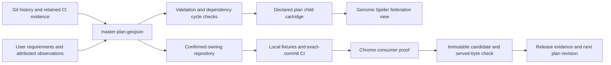

# Federated product build programme

The canonical input is [master-plan.geojson](master-plan.geojson): 50 Pipeline News and 50 GridAtlas **planned increments**, each with one change, an owner, a proposed module path, prerequisites, evidence, acceptance gates and rollback. [BUILD-PLAN.md](BUILD-PLAN.md) is generated for reading. Seven displaced candidates remain in [backlog.json](backlog.json).

The historical [release tracker](../reload/plan-tracker/README.md) retains earlier accepted, failed and staged work. These 100 entries do not rebrand those releases as new work. In particular, the GIS DOM-frame draft and staged 2028 consumer need their outstanding checks; Claude's published fault-level contract must survive the next handover.

## Data flow



The graph contains planned build/module/repository/source relations separately from the genome's observed source dependencies. Nonspatial work has null geometry. A declared workflow-to-script edge has a source commit and blob hash; it is not a claim that the migrated workflow has run.

`build.mjs` defaults to audit. `--apply` writes the compiled child cartridge, an immutable plan revision and CURRENT.json. Reusing a plan revision with different bytes fails. Future progress needs a new revision and verified receipts; the current compiler intentionally refuses to turn a planned item into an accepted release merely by changing its status.

The existing `.github/workflows/genome.yml` runs the compiler and fixtures, retains the graph/report artifact, and exposes the child manifest on the Spiders repository node. It does not dispatch workflows in other repositories or execute code discovered by the plan. The permanent federation ledger and its Parquet ownership laws remain separate; this child is a declared planning projection for its compatible viewer.

## Migration contract

Do not transfer a GlobalGrid2050 YAML or Python file until its destination repository is confirmed. First record the pinned workflow, called scripts, imports, data inputs, environment, output paths and consumer dependencies in the Spider graph. Then port the complete required dependency set into that owner and prove it works from a clean checkout without the monolith. Preserve original historical files and their manual-only schedules.

Spiders' README explicitly provides a home for market species. Proposed market adapters belong under `species/market-spider/`; the migration records are blocked pending full dependency audit. Elexon recent-week products belong beside the existing monthly owner products in data-gb-electricity. PVLive ownership and its contract must be settled before source transfer. No collector has been reactivated by this plan commit.

Weekly collection does not mean treating one instantaneous MW reading as weekly energy. Retain enough attributed source intervals to calculate coverage and MWh correctly, publish compact weekly products, and bound revision lookbacks. Closed monthly archives remain immutable. Dashboards read producer manifests, not API credentials or collection scripts.

Metals must retain exchange/instrument/contract/currency/mass units; futures are not silently labelled LME cash prices. Oil spot and futures remain separate series. FX retains its base and observation date. Failed attempts preserve the date of the last good value; no fixed fallback becomes a fresh observation. Provider redistribution terms and attribution are part of each source contract.

## Local runner

```text
node --test codex/build-plan/federation.test.mjs
node codex/build-plan/build.mjs --out=<offline-evidence-directory>
node codex/build-plan/build.mjs --apply --out=<offline-evidence-directory>
```

The evidence directory contains actual five-month reachable Git indexes and sampled CI studies. Indexing commit metadata does not mean every historical diff or release was executed. Pipeline's 4138 proximity records versus 3047 GRID/SUB records was independently measured; older board findings remain attributed until reproduced. GPU timing claims require the same CPU workload including transfer costs. Fault records are published evidence, not computed capacity or headroom.

The original straight-line engine remains the first pass. Optional route constraints, trench/HDD scenarios and financial assumptions are independent cartridges; unavailable data must not break the base map or manufacture engineering conclusions.
