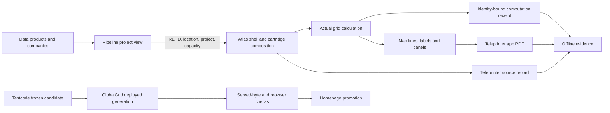

# GlobalGrid architecture and session reload

Study checkpoint: 5 September 2026. This is a source-based architectural map, not a release certificate. Refresh RELOAD.md before relying on any commit or working-copy state below. An adjacent session is still changing Teleprinter, publication tooling and a CVAA vaccine.

## Read in this order next session

1. This document for responsibilities and known traps.
2. Run reload.py using the command in README.md. Read its generated RELOAD.md and delta.json. The registry names explicit working copies; do not infer the right checkout from a familiar repository name.
3. Read the adjacent session's latest offline handover, including unfinished work and retained failures. A handover is a claim until its referenced receipts and identities have been checked.
4. Open only the changed anchors and the source path relevant to the requested behavior. Check AGENTS.md in that working copy before editing.
5. For release work, compare source commit, engine commit, generation, build hash, served bytes and evidence identity. A recent folder, green workflow or homepage label alone is insufficient.

The observer took about two seconds to inspect the original 20 checkouts and index approximately 3,300 offline files on this machine. It now also tracks the adjacent session's separate CVAA receipt worktree. Network CI collection is optional and slower. This is measured reload time, not application startup performance.

## Responsibility map

| Owner | Responsibility | Boundary |
|---|---|---|
| data-federation-map-for-globalgrid2050-all-repos | Canonical estate relationships, data contracts and generated graph products | Owns topology; should not absorb application implementations |
| spiders | Dependency and estate observation, genome products, reload discovery | Observe target state without executing captured target helpers |
| cvaa | Generalised regression antibodies, fixtures and provenance | A vaccine needs diseased and clean fixtures; a named rule alone is not protection |
| ventus-grid-engine | Screening mathematics, deep-link contract and actual-computation receipts | Actual calculation evidence is distinct from map rendering and electrical feasibility |
| grid-distance-maths | Distance and Earth-model decisions | Shared mathematical definitions should not drift between app copies |
| data-grid-gb / data-gridatlas | Network products and map data/layer fidelity | Data availability and rendering are different gates |
| companies / data-gb-electricity | Identity and electricity products | Consumer builds should retain product identity and provenance |
| pipelinenews | Project/news data, UI modules, release compilation and MAP links | A MAP link must preserve project identity and reach the intended engine-bearing Atlas |
| gridatlas | Immutable shell and hashed, ordered cartridges | Current composition, source parts and actual executed cartridge must agree |
| teleprinter | App PDF rendering and separate source-record export | PDF appearance, source completeness and download transport need separate proofs |
| testcode | Offline gates, behavioral capsules, timestamped candidate preparation and evidence | Gate inputs and checkout layout must be explicit |
| globalgrid2050 | Public entry point, deployed copies and homepage promotion | Deployment and promotion are separate steps |
| gpu-drivers-for-global-grid | Hardware experiments and comparative workload measurements | A benchmark is not an application dependency or proof of end-user acceleration |
| linux-for-the-power-grid | Technical synthesis and historical repository coverage | Useful memory, but not a live release pointer |

The repository named architecture currently has very little source. The existing federation and Spiders structures are the useful starting points. This reload instrument lives in a separate Codex-owned Spiders directory; it does not overwrite the existing genome or another agent's lane.

## Runtime and publication paths

GridAtlas's atlas/index.html reads atlas/current.json, fetches an immutable shell and resolves the ordered cartridges. The composition uses streaming-parquet-bridge, uk-gazetteer-flyto, substation-intelligence and sld-sandbox. Cartridge bytes are hashed and inserted into the known shell script slots. The inspected loader checked shell content shape but did not enforce a shell digest in the same way as cartridge hashes. That distinction belongs in future composition acceptance.

The cartridge source-part manifests and build/recompose tools matter: editing a convenient source file does not prove the running cartridge changed. Mixed cartridge timestamps can be legitimate when unchanged components retain their identity. The composed manifest is the join point. STATE.md was stale relative to current.json and the served generation during this review.

The grid engine's compute observer distinguishes requested, started, completed, completed_empty, failed and unsupported operations. It binds attempts to the selected entity and location. The inspected detector validates actual operation, identity and distance parity, not merely the existence of a global API alias. An independent radius of 6378.137 km and tight raw-distance comparison are screening checks; they do not prove network connection feasibility.

Testcode's Teleprinter build is two-phase. Prepare copies a predecessor into a new immutable timestamped generation, reads the engine at a specific Git commit, adds the app bootstraps and restamps required cartridges. After committing source, finish makes source bundles from pinned committed scopes and verifies working bytes. The publication worktree copies the prepared generation under testcode/, deploys it, verifies served bytes, then separately updates the homepage. Inherited detector results explicitly marked rerun:false remain historical evidence.

## Working-copy identity is part of the architecture

The ordinary gridatlas checkout was on candidate/promotion-lane at 3061dfc. The main-line working tree gridatlas-main-202609050200 was at 805b4b1, with current generation 202609051624. These are not interchangeable.

The ordinary testcode checkout and C:/Users/vikra/testcode-source-publication have different roles. The former sits beside ventus-grid-engine under Documents/GitHub. The latter is an isolated publication worktree directly under the user directory. A relative sibling import in the detector succeeded in the former and failed with ERR_MODULE_NOT_FOUND in the latter. This is a concrete environment assumption, not evidence that the detector's mathematics failed.

Similarly, the ordinary globalgrid2050 checkout lagged the globalgrid-testcode-publication worktree. The latter deployed 202609051820 at 30df31f3 while the ordinary checkout still represented the earlier daily-final homepage commit 95bf285f.

The original cvaa checkout is a Codex candidate branch at 19a20ce with an existing untracked vaccine. The adjacent session created C:/Users/vikra/cvaa-codex-receipt from main 4b17c41 and committed its runtime-endpoint vaccine at a1fae46. A failure in the older candidate checkout must not be attributed automatically to the new vaccine worktree.

## Teleprinter: what changed today and what each test proves

The 1623 implementation defaulted to getDisplayMedia. That invoked Chrome's sharing picker, despite automated tests passing with a supplied screenshot. The user's requirement is the visible app, including its map, layers, legends and panels, with no browser or desktop capture chooser. The 50 host-screenshot visits did not establish that interaction.

The new Codex route is controls.js -> print-screen.js -> app-frame.js -> screen-pdf.mjs. The normal path uses vendored html2canvas 1.4.1, waits for fonts, snapshots visible canvases at a map render event, replaces cloned canvases with decoded images, and renders the app viewport at device pixel ratio. It hoists the fixed File bar out of a clipping context and reconstructs the printer's own shadow-root controls. The 15e85b6 engine revision waits for image.decode. Controls dismiss menus before capture.

The PDF writer preserves supplied RGB pixels with external header/footer furniture. That proves the writer's treatment of its input; it does not make HTML reconstruction identical to the browser compositor. The app comparison uses approximate per-region thresholds. A successful download and correct dimensions can coexist with a missing menu, absent layer or fidelity failure. One reviewed earlier six-browser artifact passed download checks but failed its left-region threshold at approximately 0.844 against 0.85.

Source export is separate. It combines pinned source bundles with observed runtime state and discovered resources. Hashes, explicit unavailable resources and completeness limitations matter. Refetched resources are not necessarily the exact bytes originally executed. Diagnostic strings inside source are not failed fetches. Nonliteral imports cannot be inferred exhaustively from string scanning. Very large source text and PDF exports need mobile usability checks as well as byte integrity.

Current adjacent-session checkpoint: generation 202609051820, source faa66443a7754878f51b2cc5155a21692dbdaecf, engine 15e85b6d1444967005fb825d5d1d8439667ffcd5, build SHA-256 42782185656a1db608411afaaa7ba8ce1aa8dda604d3783d6ff8e8f6df8f34d2. Its local 50-visit run saved 50 downloads but reported ok:false. A smaller deployed check and corrected-local-server check subsequently reported two successful visits each. Those two visits do not replace the failed 50-visit record or constitute a new 50-visit pass.

The local diagnostic endpoint /__testcode/receipt is posted only for localhost/127.0.0.1. A plain static server lacks it. The adjacent session is adding serve.py and a CVAA vaccine for environment/endpoint evidence. Preserve the GET 404 / POST 501 reproduction and evaluate the corrected server separately. Do not remove the endpoint from source discovery merely to make a checker green.

## GPU work: substantive findings

The GPU repository contains browser WebGPU/WGSL experiments inspired by CUDA performance techniques. It is not a native CUDA driver implementation. bench-cpu-ram.mjs measures independent worker copies, memory and parsing/search operations. bench-gpu.mjs compares upload/layout/workgroup/resident-buffer variants. Hardware adapter identity is recorded; the high-performance preference is not an assurance that the intended discrete adapter was selected.

The measured real source text was 27,568,130 bytes, with 112 sections and 43,820 separator characters. The historical CPU Buffer.indexOf comparison was around 3.6 ms; GPU baseline upload plus compute was about 7.18 + 2.35 ms. The resident variant's roughly 3.025 ms was about 3.15 times faster than the GPU baseline, not 3.15 times faster than the CPU. Upload residency changes the question being measured. Parsing and byte counting are different workloads.

The corpus experiment covered 223 files, 40,161,723 bytes and 24,753 pair comparisons. It reported 12 exact duplicate groups and 487,454 duplicate bytes, around 1.2 percent. Thousands of histogram-similar nonidentical pairs are not deduplicatable bytes. The inspected record had no equivalent CPU all-pairs baseline, so it cannot establish a GPU speedup for that corpus operation. A directory of historical source is also not a release's actual network dependency closure.

A fresh CPU run on the same real text, saved offline during this architecture review, agreed on hashes and section counts: one worker approximately 79.4 ms and 331 MB/s; two workers 81.3 ms and 647 MB/s; four workers 98.2 ms and 1071 MB/s aggregate, with RSS rising from roughly 243 to 602 MB. Each worker processes its own input copy. These are aggregate throughput measurements, not a fourfold reduction of one user's wait. No new GPU timing was claimed in this review.

The GitHub workflow runs a CPU stand-in and explicitly skips GPU work. Its green result therefore cannot certify the GPU path. Future experiments should report wall time, upload, compute, readback, peak memory, adapter, corpus hash, warm/cold state, correctness oracle and a same-workload CPU baseline independently. Prioritise transfer elimination and avoiding repeated parse/copy work before claiming hardware acceleration.

## CI and evidence interpretation

Read the offline ci-runs.json and ci-jobs.json for exact run identities and links. During this review:

- Grid engine local verification passed its 10 proofs and 155 reported checks.
- Spiders estate-survey tests passed 30 checks.
- The older CVAA candidate selftest failed three antibody problems around its pre-existing disk-is-not-what-ships addition. This is distinct from successful main CI and the new receipt worktree.
- Testcode CI failed at its offline gate; downstream map/menu checks were skipped. Its workflow inputs and registry requirements need reconciliation. Generic exit annotations alone do not identify every failing gate.
- GridAtlas parse CI passed while broader cartridge proof failed on the same inspected revision; later browser steps were skipped.
- data-gridatlas offline fidelity passed while the live layer toggle step failed. A successful watchdog is not the same test.
- Deployment workflows can succeed while exact-version or retained-publication checks fail. Inspect workflow scope and commit, not a single green icon.

The offline folder held roughly 7.66 GB at the first inventory. This review indexed metadata and opened 190 PDFs totalling 780 pages; selected PDFs and screenshots were visually examined. That is not a claim that every page's visual correctness was assessed. The folder continued growing during review.

The attachment Good-print-codex-but-layers-dont-show-on-print-please-check.pdf identifies generation 202609051300 internally. Its missing layers and panels are visible. Another source-control complaint screenshot points to the older Atlas 202609051211 route. They must not be silently attributed to 1820.

The 591-page iPhone source PDF in iphone-source-202609061624 internally identifies the main GridAtlas URL, generation 202609051510 and capture time 5 September 15:21 UTC. It explicitly truncates data resources to 4,000 characters. Its filename is not authoritative release identity and it is not a complete source archive. The separate physical-iPhone screenshot record claims a different Testcode generation; do not merge those into one test.

Physical screenshots showed a Wraysbury view alongside a detector badge for another REPD identity. A fresh main-Atlas search in Chrome returned Wraysbury REPD 1938. That discrepancy needs an identity-bound interaction test, not an assumption that a visible completed badge proves the currently selected project was computed.

## Chrome observations from this review

Using the installed Chrome UI, the daily-final homepage led to 1623 Pipeline. Searching East Anglia found Norfolk Vanguard East, and its MAP link retained REPD 2484 and location into 1623 Atlas. The resulting view displayed ENGINE COMPLETED and a 77.77 km Sizewell B connection. Screenshot and accessibility state were retained offline.

The main Atlas URL independently served current generation 1624. Searching Wraysbury selected REPD 1938 and displayed its 4.8 MW popup. The observed screen did not show a corresponding grid-distance card or line during that interaction. This records visible behavior; it is not a claim about every internal engine call.

The newly deployed 1820 URL briefly returned 404 during deployment, then its release.json became available with the expected engine identity. A transient deployment observation must remain timestamped rather than being converted into a permanent product failure. Further Chrome receipts belong in the offline architecture review folder.

## Improvements for the next build and next session

1. Bind all acceptance to an explicit release tuple and environment profile. Include dynamic diagnostic endpoints in local-server requirements. Require source and PDF results independently.
2. Update the acceptance gate for the actual app-render route. Screen-sharing must be forbidden during normal print tests, and screenshots used only as independent references. Retain per-region failures, physical-device limits and source-size usability results.
3. Test selected project identity after search and MAP navigation, including stale completion badges, empty results and failed attempts. Verify raw computed and actually drawn lines as separate facts.
4. Give Testcode an explicit repository-path contract that works in isolated worktrees. CI must materialise every required input or clearly fail as an environment precondition before calling product gates.
5. Generate STATE and homepage release descriptions from pinned acceptance records. Keep candidate deployment, accepted release and historical comparison states distinct.
6. Preserve immutable per-run receipts. Mutable convenience files such as fifty-prints-results.json are pointers, not history. The reload delta should surface newly added and modified evidence without treating either as a pass.
7. Extend the federation/Spiders registry with proved relationships and introduce CVAA rules with focused clean/diseased fixtures. Keep the human architecture concise enough to reload, with detailed evidence remaining in the offline store.
8. Use the GPU work to select bottlenecks from measured real paths. Source reload is primarily an identity, indexing and changed-content problem; the current two-second metadata/anchor scan does not justify GPU infrastructure by itself.

## Scope and storage

Only codex/reload in Spiders and this review's offline directory are owned by this architecture task. Product fixes, the adjacent handover and its vaccine belong to the adjacent session. Do not stage their files accidentally. No publication is implied by this document.

Offline review directory: C:/Users/vikra/OneDrive/Desktop/offline-screenshots/architecture-reload-20260905. The original evidence stays in place. The observer never executes an attached source file, conversation command or captured helper. It detects metadata and anchor drift; it is not an unattended background service and its consistency check is not an atomic freeze.

## Subsequent checkpoint

The adjacent handover completed at handover-202609051831. Independent endpoint tests were rerun successfully in its new worktree. Direct Chrome printing of 1820 then refused with "The app print dimensions changed during capture." Geometry 2048 x 972 at DPR 1.875 exposes floor-versus-round disagreement between html2canvas and app-frame.js. See BUILD-PLAN.md for the correction and fractional-DPR regression requirement. No PDF or screen-sharing chooser resulted in that check.

## Expanded implementation ownership

Subsequent explicit user authorization enabled the eight candidate increments and the new GIS/layout producer repositories. The earlier architecture-only scope above describes the initial review. The owner registry now includes 24 explicit working copies, including standalone `gis-sld-sandbox` and `layout-tool`. See the build-plan producer checkpoint and the plan tracker for current candidate status. Root application behavior, producer baselines, consumer composition, publication bytes and proof artifacts remain separately identified. The source/print coverage of Atlas does not automatically extend into isolated tool iframes.

## Historical company context and assessment boundaries

The user supplied a Ventus company profile explicitly described as four years out of date. The original statement is retained offline as `ventus-company-context-user-provided.json`; its experience, installed-capacity and customer figures are historical user-provided claims, not independently verified current marketing facts. Do not publish refreshed claims from that record.

Its architectural relevance is application-specific assessment with source and assumption traceability. Keep geometry, electrical calculations, installation method, financial assessment, procurement/installation records and monitoring/warranty traceability as separate responsibilities with explicit handoffs. A result for one sector, voltage or construction method is not automatically a validated result for another. Link evidence to the source revision and assumptions used by that assessment.

## Product purpose

The user's objective is accessible power infrastructure that supports economic growth, with access and interoperability comparable to the internet. Translate that into inspectable calculations, portable source-bound data, explicit assumptions and usable tools on ordinary browsers. Keep engineering methods replaceable behind small contracts, with independent validation and clear evidence ownership. This is the design direction, not a claim that an automated system has already made engineering decisions or delivered economic outcomes.

For current implementation status, begin with BUILD-PLAN.md's1906 checkpoint and the next-fifty queue. Older diagnostic sections describe the session's original baseline; they do not reopen defects whose later scoped evidence passed.
